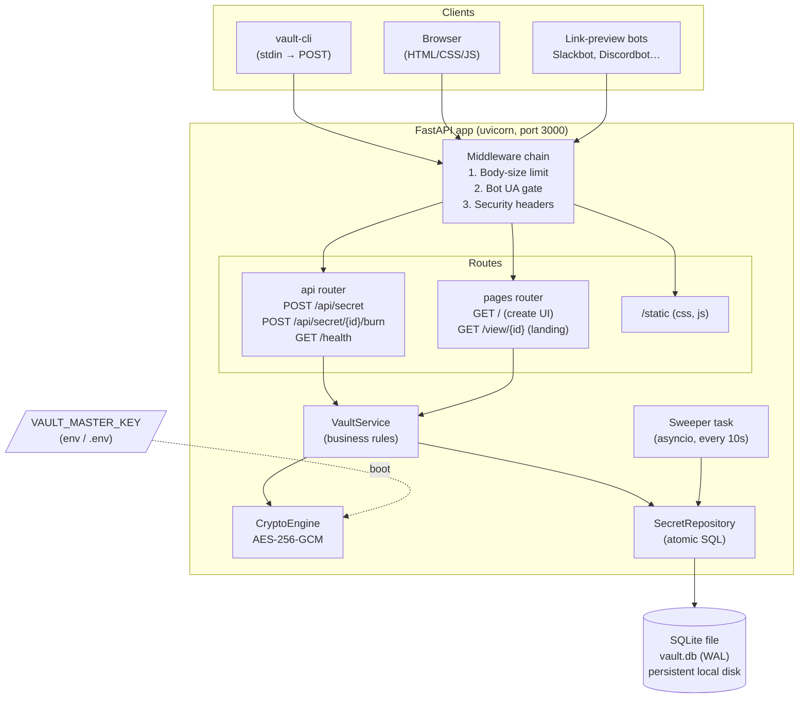
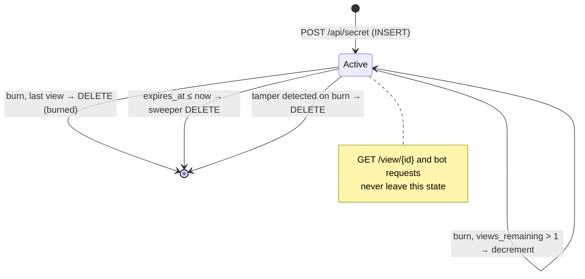
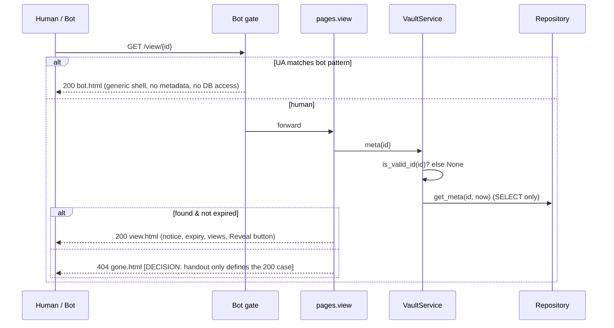
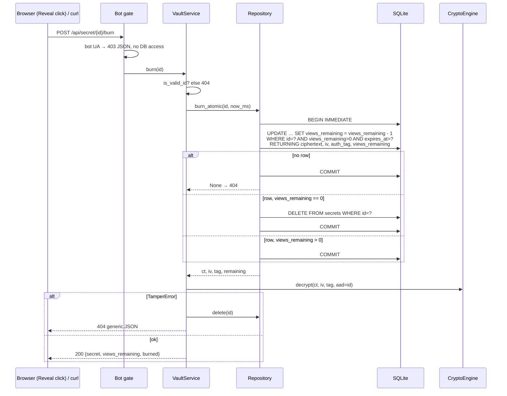
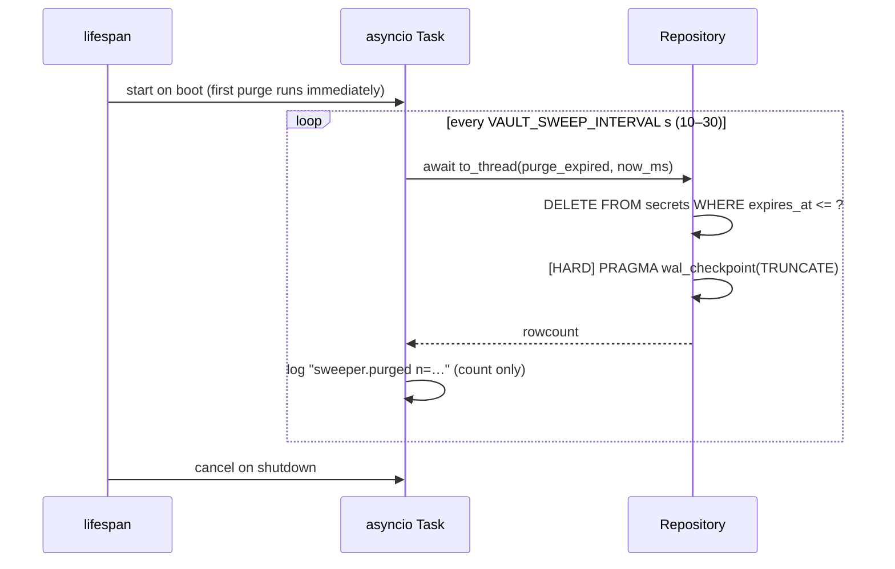

# System Design — Ephemeral Secret Vault

**Stack:** Python 3.11 · FastAPI · Uvicorn · SQLite 3.35+ (WAL) · `cryptography` (AES-256-GCM) · Jinja2 · plain HTML/CSS/JS
**Companion docs:** [PRD.md](PRD.md) · [IMPLEMENTATION_PLAN.md](IMPLEMENTATION_PLAN.md)
**Source of truth for scope:** `Ephemeral_Secret_Vault_IT HAPPENS @ RAALE #9.pdf` (the handout)

### Scope labels used in this document

| Label | Meaning |
|---|---|
| **[REQ]** | Required by the handout (Part 4 contract, Part 5 rules, Part 7.1 must-haves, Part 10 checklist, Part 12 FAQ). |
| **[HARD]** | Recommended engineering hardening. Not required by the handout; can be dropped if time runs out without failing a must-have. |
| **[STRETCH]** | Distinction feature from handout Part 7.2. Built only after every [REQ] passes. |
| **[DECISION]** | A choice where the handout is silent or allows options. Must be stated in REPORT.md. |

Anything without a label is structural description, not a requirement.

---

## 1. Design Principles

| # | Principle | What it means in code |
|---|---|---|
| P1 | **Plaintext is ephemeral** | Plaintext is **never persisted as application data**. It is never written to the SQLite database, logs, error messages, or HTTP caches. It exists only in process memory while a create or burn request is being handled. The database stores only ciphertext, IV and auth tag **[REQ]**. OS-level copies of process memory (swap/pagefile, crash dumps) are outside the application's control (see §5.4). |
| P2 | **GET is safe, POST mutates** | No `GET`/`HEAD` route can decrement views or delete a row. Burning happens only via `POST /api/secret/{id}/burn` **[REQ]**. |
| P3 | **The database enforces one-view** | The one-view guarantee comes from a single conditional SQL mutation, serialized by SQLite's write lock. There are no Python locks. See §7.4 **[REQ]**. |
| P4 | **Hard delete** | Destroyed secrets are removed with `DELETE`; no soft-delete flags **[REQ]**. `PRAGMA secure_delete = ON` and WAL checkpointing reduce leftover data inside SQLite's files **[HARD]**. These are hardening measures, not a guarantee against forensic recovery (see §5.4). |
| P5 | **Fail closed, fail quiet** | Every failure is refused without revealing anything, and the response format matches the channel: **API** failures return the generic JSON error envelope; **HTML page** failures return a generic HTML page; **bots** are handled by the scraper-defense policy in §8. No response may contain stack traces, plaintext secrets, request bodies, or state details beyond the contract. For example, "burned", "expired" and "never existed" all return the same 404. |
| P6 | **Defense in depth** | The GET/POST split **[REQ]** is the core guarantee. The bot user-agent gate **[REQ]** is a second required layer. Security headers and CSP **[HARD]** add further protection. Each layer works on its own (§8). |

---

## 2. High-Level Architecture



### Layered view

```
┌────────────────────────────────────────────────────────────────────┐
│ PRESENTATION   templates/view.html, bot.html, index.html,          │
│                gone.html, error.html                               │
│                static/js/create.js, reveal.js · static/css/app.css │
├────────────────────────────────────────────────────────────────────┤
│ TRANSPORT      FastAPI routers · Pydantic schemas · middleware     │
│                exception handlers (JSON for /api, HTML for pages)  │
├────────────────────────────────────────────────────────────────────┤
│ DOMAIN         VaultService: create(), burn(), meta()              │
│                id generation, TTL/view rules                       │
├────────────────────────────────────────────────────────────────────┤
│ CRYPTO         CryptoEngine: encrypt(pt, aad) / decrypt(...)       │
├────────────────────────────────────────────────────────────────────┤
│ PERSISTENCE    SecretRepository: insert, burn_atomic, get_meta,    │
│                purge_expired, delete · thread-local connections    │
├────────────────────────────────────────────────────────────────────┤
│ BACKGROUND     Sweeper (asyncio task → to_thread(purge_expired))   │
└────────────────────────────────────────────────────────────────────┘
```

Each layer calls only the layer below it. Routes never write SQL, and the repository never sees plaintext.

---

## 3. Project Structure

```
ephemeral-vault/
├── app/
│   ├── __init__.py
│   ├── main.py            # create_app(), lifespan (schema, key check, sweeper)
│   ├── config.py          # Settings (env): key, db path, base url, limits
│   ├── crypto.py          # CryptoEngine: encrypt/decrypt ONLY (core)
│   ├── db.py              # connection factory, PRAGMAs, schema, version check
│   ├── repository.py      # SecretRepository: ALL SQL lives here
│   ├── service.py         # VaultService: create / burn / meta
│   ├── sweeper.py         # async periodic purge
│   ├── schemas.py         # Pydantic request/response models
│   ├── security.py        # bot detection, headers + body-limit middleware
│   ├── errors.py          # NotFound + exception handlers (JSON vs HTML)
│   ├── ids.py             # new_id(), is_valid_id()
│   ├── routes/
│   │   ├── api.py         # /api/secret, /api/secret/{id}/burn, /health
│   │   └── pages.py       # /, /view/{id}
│   ├── templates/
│   │   ├── base.html
│   │   ├── index.html     # create-secret UI
│   │   ├── view.html      # landing + Reveal button
│   │   ├── gone.html      # 404 page
│   │   ├── error.html     # generic 500 page
│   │   └── bot.html       # generic shell for crawlers
│   └── static/
│       ├── css/app.css
│       └── js/
│           ├── create.js
│           └── reveal.js
├── cli/
│   ├── vault-cli          # #!/usr/bin/env python3 (stdlib only)
│   └── vault-cli.cmd      # Windows shim → python vault-cli %*
├── tests/
│   ├── conftest.py        # temp DB, test key, TestClient, live-server fixture
│   ├── test_crypto.py
│   ├── test_api.py
│   ├── test_scraper.py
│   ├── test_race.py       # 20 parallel burns against a live uvicorn server
│   ├── test_sweeper.py
│   ├── test_tamper.py
│   └── test_hostile.py
├── scripts/
│   ├── race.sh            # curl + xargs -P 20 demo for judges
│   ├── inspect_db.sh      # sqlite3 dump / grep plaintext check
│   └── bench.md           # [STRETCH] autocannon/k6 commands
├── .env.example           # VAULT_MASTER_KEY=  (empty)
├── .gitignore             # .env, *.db, *.db-wal, *.db-shm, __pycache__
├── requirements.txt
├── README.md
└── REPORT.md
```

Files for stretch features (fingerprint helper, password columns, E2E JS) are added **only when that stretch feature is built**. The core tree above has no dependency on them.

**requirements.txt**
```
fastapi>=0.110
uvicorn[standard]>=0.29
cryptography>=42
jinja2>=3.1
python-dotenv>=1.0
pytest>=8
httpx>=0.27
```

---

## 4. Configuration

| Env var | Default | Scope | Notes |
|---|---|---|---|
| `VAULT_MASTER_KEY` | *(none)* | [REQ] key comes from env or is generated at boot (handout FAQ) | 64 hex chars = 32 bytes. Missing → generate an ephemeral key and log a WARNING (secrets are lost on restart). Invalid → **refuse to boot** [HARD]. |
| `VAULT_DB_PATH` | `./vault.db` | | Must be on persistent local storage (§13). `:memory:` only in tests. |
| `VAULT_BASE_URL` | `http://localhost:3000` | | Used to build `view_url`. |
| `VAULT_SWEEP_INTERVAL` | `10` | [REQ] handout: 10–30 s | Clamped to 5–30. |
| `VAULT_MAX_SECRET_BYTES` | `65536` | [HARD] | Limit on the UTF-8 size of the plaintext. |
| `VAULT_MAX_TTL` | `604800` | [HARD] | 7 days. |
| `VAULT_MAX_VIEWS` | `100` | [HARD] | |
| `VAULT_MAX_BODY_BYTES` | `131072` | [HARD] | Enforced by middleware before JSON parsing. |
| `VAULT_ENABLE_DOCS` | `0` | [HARD] | `/docs`, `/openapi.json` off unless set to `1`. |

Generate a key with `python -c "import secrets;print(secrets.token_hex(32))"`. The key is never stored in the database or committed to git **[REQ]**.

---

## 5. Data Design

### 5.1 Schema [REQ] (exactly as in the handout)

```sql
CREATE TABLE IF NOT EXISTS secrets (
  id               TEXT    PRIMARY KEY,
  ciphertext       BLOB    NOT NULL,
  iv               BLOB    NOT NULL,     -- 12 bytes
  auth_tag         BLOB    NOT NULL,     -- 16 bytes
  max_views        INTEGER NOT NULL DEFAULT 1,
  views_remaining  INTEGER NOT NULL DEFAULT 1,
  expires_at       INTEGER NOT NULL,     -- epoch ms (UTC)
  created_at       INTEGER NOT NULL      -- epoch ms (UTC)
);
CREATE INDEX IF NOT EXISTS idx_secrets_expiry ON secrets(expires_at);
```

There is no plaintext column, key column, or `is_deleted` flag. Stretch features that need extra columns add them only when built (§16).

### 5.2 Connection strategy

- FastAPI runs **sync `def` endpoints in a threadpool** (AnyIO, 40 threads by default). A `sqlite3.Connection` must not be shared across threads, so each thread gets its own connection via `threading.local()`.
- Every connection is opened with:
  ```python
  sqlite3.connect(path, isolation_level=None, timeout=5.0)  # autocommit; we issue BEGIN ourselves
  PRAGMA busy_timeout = 5000;      -- wait for the write lock instead of failing immediately
  PRAGMA synchronous = NORMAL;     -- safe with WAL
  PRAGMA secure_delete = ON;       -- [HARD] zero deleted content in DB pages
  ```
  `PRAGMA journal_mode = WAL` is set once at boot. It is stored in the database file. The handout strongly recommends WAL mode as the storage setup rather than listing it as a must-have.
- At boot the app **asserts `sqlite3.sqlite_version >= 3.35.0`**, which is needed for `RETURNING`. The dev machine has 3.53.1.

### 5.3 Lifecycle state machine



There is no "deleted" state in the application. A row either exists and is readable through the API, or it does not exist.

### 5.4 What deletion does and does not guarantee

| Level | Guarantee | Scope |
|---|---|---|
| **Application** | After a final burn, expiry sweep, or tamper detection, the row is gone: `SELECT … WHERE id = ?` returns nothing, and every API call for that ID returns 404. | **[REQ]** |
| **Stored content** | Plaintext is never written to SQLite, so the database file, WAL, and any leftover pages can only ever contain **ciphertext, IV and tag**, which are useless without the master key. | **[REQ]** (encryption at rest) |
| **SQLite leftovers** | `secure_delete = ON` overwrites deleted content with zeros in database pages. In WAL mode, earlier copies of pages can remain in `vault.db-wal` until a checkpoint overwrites or truncates them. After each sweep, the sweeper runs `PRAGMA wal_checkpoint(TRUNCATE)`; if that fails because readers are active, it just tries again next cycle. | **[HARD]** |
| **Below SQLite** | Filesystem journaling, SSD wear-levelling/TRIM, snapshots, backups, and OS swap/crash dumps can keep old bytes. The application **cannot** guarantee forensic erasure at this level. Mitigations: anything left behind is ciphertext; full-disk encryption; client-side E2E (§16.3). | Out of scope. Stated in REPORT.md limitations. |

In this design, **"zero trace" means** no readable plaintext and no live record after destruction. It does **not** mean guaranteed physical erasure of every byte ever written.

---

## 6. Crypto Design (core)

### 6.1 Primitives

| Item | Choice | Scope | Why |
|---|---|---|---|
| Cipher | AES-256-GCM (`cryptography.hazmat.primitives.ciphers.aead.AESGCM`) | [REQ] | Authenticated encryption: confidentiality and integrity in one step. |
| Key | 32 bytes from `VAULT_MASTER_KEY` | [REQ] | Kept out of the DB and out of git. |
| IV / nonce | `os.urandom(12)` **per secret** | [REQ] | 96-bit random nonce is the GCM standard. Reusing a nonce with the same key breaks GCM. |
| Tag | 16 bytes (128-bit) | [REQ] | `AESGCM.encrypt` appends it to the ciphertext; we split it off into `auth_tag`. |
| AAD | `id.encode()` | [HARD] | Binds each ciphertext to its row, so swapping ciphertext between rows makes decryption fail. |

`CryptoEngine` exposes **only** `encrypt` and `decrypt`. It has no fingerprinting, hashing, or password logic; those are stretch features (§16) that sit outside the core engine.

### 6.2 Flow

```
encrypt(plaintext: str, aad: bytes) -> Sealed
    iv  = os.urandom(12)
    out = AESGCM(key).encrypt(iv, plaintext.encode("utf-8"), aad)
    return Sealed(ciphertext=out[:-16], iv=iv, tag=out[-16:])

decrypt(ciphertext, iv, tag, aad) -> str
    if len(iv) != 12 or len(tag) != 16: raise TamperError
    try:    return AESGCM(key).decrypt(iv, ciphertext + tag, aad).decode("utf-8")
    except (InvalidTag, UnicodeDecodeError): raise TamperError
```

`TamperError` is caught in `VaultService`. The row is deleted and the client gets the standard 404 **[REQ: "fails cleanly without leaking stack traces"; the handout allows 404 or 400]**.

### 6.3 Why not Base64 / hashing? [REQ: explain in REPORT.md]
- Base64 and rot13 are encodings, not encryption. Anyone can reverse them without a key.
- Hashing (MD5/SHA-256) is one-way, so the recipient could never get the secret back. Unsalted hashes of short secrets can also be brute-forced.
- AES-CBC/CTR without a MAC can't detect tampering, so a flipped bit would decrypt to corrupted plaintext.
- A hardcoded or global IV reuses the nonce, which breaks GCM's confidentiality and authenticity. Every secret therefore gets a fresh random IV.

---

## 7. Request Flows

### 7.1 Create [REQ]

```mermaid
sequenceDiagram
    participant C as CLI / Browser
    participant M as Middleware
    participant A as api.create
    participant S as VaultService
    participant K as CryptoEngine
    participant R as Repository
    participant D as SQLite

    C->>M: POST /api/secret {secret, ttl_seconds, max_views}
    alt body > limit
        M-->>C: 413 JSON  [HARD]
    else bot User-Agent
        M-->>C: 403 JSON  [REQ: rejected]
    else
        M->>A: forward
        A->>A: Pydantic validate → 400 JSON on failure [HARD]
        A->>S: create(secret, ttl, views)
        S->>S: id = token_hex(8); now_ms; expires_ms
        S->>K: encrypt(secret, aad=id)
        K-->>S: ct, iv, tag
        S->>R: insert(row)
        R->>D: INSERT INTO secrets …
        S-->>A: id, expires_at, views
        A-->>C: 201 {id, view_url, expires_at, views_remaining}
    end
```

The core response has **exactly the four contract fields**. On an ID collision (`IntegrityError`, ~2⁻⁶⁴ chance), retry up to 3 times.

### 7.2 View (safe landing page) [REQ]



`get_meta` is a plain `SELECT` and cannot change state **[REQ]**.

### 7.3 Burn [REQ]



`burned` is `true` when this read used the last view and the row was deleted, and `false` on earlier reads of a multi-view secret **[DECISION]**.

### 7.4 Concurrency correctness [REQ: zero double-reads]

**Core invariant**

> *Only one transaction can successfully satisfy the final-view condition (`views_remaining > 0`) and obtain the ciphertext for that view.*

More generally, a secret created with `max_views = N` returns ciphertext to **at most N** successful transactions, however many requests arrive at once.

**Why the invariant holds**

1. **The conditional mutation is the invariant.** The check (`views_remaining > 0 AND expires_at > now`) and the decrement are **one SQL statement**. `RETURNING` hands the ciphertext only to the transaction whose `UPDATE` actually matched a row. There is no `SELECT → check in Python → UPDATE` sequence, so there is no gap in which two requests can both see `views_remaining = 1`.
2. **SQLite serializes the competing writers.** `BEGIN IMMEDIATE` takes the database's write lock at the start of the transaction, and only one connection can hold it at a time, across threads *and* processes. The other requests wait (up to `busy_timeout`). When each one gets the lock, it evaluates the `WHERE` clause against the **committed** state, where `views_remaining` is now 0 or the row is gone. Their `UPDATE` matches nothing, `RETURNING` yields no row, and they return 404.
3. **The final `DELETE` is in the same transaction** as the last decrement. No other transaction ever sees an intermediate state with `views_remaining = 0`. `BEGIN IMMEDIATE`, rather than a deferred `BEGIN`, is what makes the `UPDATE` + `DELETE` pair one unit. It also avoids lock-upgrade deadlocks under contention.
4. **Decryption happens after commit**, using only the bytes this transaction received through `RETURNING`. Other requests never receive those bytes, so exactly one concurrent request can receive the final plaintext.

**Consequences**

- No Python mutex is needed for correctness, and one should not be added. It would not cover multiple processes anyway.
- 20 parallel burns of a 1-view secret → exactly **1×200** and **19×404**.
- If a waiting request exceeds `busy_timeout`, it gets a generic 500 JSON and **never** plaintext. The invariant still holds. With millisecond-scale transactions and a 5 s timeout, this should not happen in the 20-request test.
- If the process crashes after `COMMIT` but before responding, that view is consumed without being delivered. The system fails closed.

**Python gotcha:** with `RETURNING`, call `cursor.fetchall()` **before** `COMMIT` so the statement is fully executed.

### 7.5 Sweeper [REQ]



- Uses `idx_secrets_expiry`, so the purge is an index range scan.
- Exceptions are logged and the loop continues. One failed sweep does not stop future sweeps.
- Reads also check `expires_at > now`, so an expired secret is unreadable even before the next sweep runs **[REQ: "expired secrets cannot be read"]**.
- If several workers each run a sweeper, that is harmless, because `DELETE` is idempotent.

---

## 8. Scraper / Bot Defense

### 8.1 Layers

| Layer | Mechanism | Scope | Stops |
|---|---|---|---|
| L1 | **HTTP method split**: `GET /view` is read-only; burn is `POST`-only (`GET` on burn → 405) | [REQ] | All link unfurlers, which only send `GET`/`HEAD`. Browser prefetch and prerender are also `GET`s, so L1 covers them too. |
| L2 | **User-agent gate** (middleware, case-insensitive) on **every** route | [REQ] | Bots that identify themselves |
| L3 | **Human action**: Reveal is a JS `fetch` POST triggered by a click (plus a `confirm()` dialog [HARD]) | [REQ] | Fetchers that don't run JS or click |
| L4 | **Headers**: `X-Robots-Tag: noindex, nofollow`, `<meta name="robots">`, `Cache-Control: no-store`, `Referrer-Policy: no-referrer` | [HARD] | Indexing, caching, and the link leaking via Referer |

### 8.2 Bot signatures

The handout's minimum list is `bot`, `crawl`, `spider`, `Slackbot`, `facebookexternalhit` **[REQ]**. The extended list adds common unfurlers **[HARD]**:

```python
BOT_UA = re.compile(
    r"bot|crawl|spider|slurp|facebookexternalhit|facebookcatalog|embedly|"
    r"slack|discord|whatsapp|telegram|skypeuripreview|teams|linkedin|"
    r"twitter|pinterest|vkshare|quora|outbrain|bitly|"
    r"preview|unfurl|google-inspectiontool|mastodon",
    re.I,
)
```

`curl` and normal browsers must **not** match, because judges use curl. Tests cover both matching and non-matching user agents.

### 8.3 Bot response policy [REQ: "rejected or served a blank response without modifying state"]

| Route | Bot receives | Touches DB? |
|---|---|---|
| `GET /view/{id}` | **200** `bot.html`: a generic "Secure secret" shell with neutral OG tags and no ID/expiry/views (handout Scenario B: "the bot receives an HTML shell") | No, not even to check that the ID exists |
| `POST /api/secret/{id}/burn` | **403** `{"error": "Automated clients are not permitted."}` | No |
| `POST /api/secret` | **403**, same JSON | No |
| Any other route (`/`, `/static/*`, `/health`) | **403**, empty body | No |

L1 is what actually guarantees bots can't burn a secret. L2 can be bypassed by spoofing the user agent, so it's defense in depth. REPORT.md should say this honestly.

---

## 9. API Surface

### 9.1 Routes

| Method | Path | Success | Errors | Mutates? |
|---|---|---|---|---|
| POST | `/api/secret` | 201 [REQ] | 400 [HARD], 403 bot [REQ], 413 [HARD] | INSERT |
| GET | `/view/{id}` | 200 HTML [REQ] | 404 HTML [DECISION] | **No** [REQ] |
| POST | `/api/secret/{id}/burn` | 200 [REQ] | 404 [REQ], 403 bot [REQ] | UPDATE/DELETE |
| GET | `/api/secret/{id}/burn` | — | 405 (framework default) | No |
| GET | `/` | 200 HTML (create UI) | — | No |
| GET | `/health` | 200 `{"status":"ok"}` (handout timeline P1) | — | No |
| GET | `/static/*` | 200 | 404 | No |

### 9.2 Error responses (P5 applied)

**API routes (`/api/*`): JSON envelope `{ "error": "<message>" }`**

| Case | Status | Message | Scope |
|---|---|---|---|
| Missing, expired, burned, malformed ID, or tampered | 404 | `Secret not found, expired, or already destroyed.` (identical for all cases) | [REQ] |
| Validation error / malformed JSON | 400 (FastAPI's default 422 is overridden) | `Invalid request: <field>: <reason>`; the submitted value is never echoed | [HARD] |
| Body too large | 413 | `Payload too large.` | [HARD] |
| Bot user agent | 403 | `Automated clients are not permitted.` | [REQ] |
| Unhandled exception / DB busy timeout | 500 | `Internal server error.` | [HARD] |

**HTML page routes (`/`, `/view/*`, unknown paths): generic HTML**

| Case | Status | Page |
|---|---|---|
| Unknown / expired / burned / malformed view ID, unknown path | 404 | `gone.html`: "This secret doesn't exist, has expired, or was already viewed." |
| Unhandled exception | 500 | `error.html`: "Something went wrong." |
| Bot user agent | per §8.3 | `bot.html` or empty 403 |

The exception handlers pick JSON or HTML by path prefix (`/api/` → JSON). Neither kind of response contains stack traces, exception text, request bodies, or plaintext. FastAPI runs with `debug=False`.

---

## 10. Frontend Design (HTML/CSS/JS, no framework)

### 10.1 Pages

| Page | Route | Content | Scope |
|---|---|---|---|
| **Landing** | `/view/{id}` | 🔒 *"You have been sent a secure, self-destructing secret."*, expiry (server-rendered ISO, localized by JS), views remaining, and a prominent **Reveal and Destroy Secret** button | [REQ] |
| **Revealed** | same page, after the click | Secret in `<pre>` via `textContent`, **Copy** button, banner "This secret has been destroyed" (or "N views left") | [REQ] reveal / [HARD] extras |
| **Gone** | 404 | Generic "not found / expired / already viewed" | [DECISION] |
| **Bot shell** | bots on `/view` | Minimal page with generic OG tags only | [REQ] |
| **Create** | `/` | Textarea, TTL dropdown (5 min / 1 h / 1 day / 7 days), views (1–10), **Create link**. Shows the link with **Copy**, expiry, and views. Clears the textarea after success. | [HARD]: the handout requires an API/CLI for creating secrets, not a web form |

The create page offers 1–10 views for convenience. The API accepts up to `VAULT_MAX_VIEWS`.

The landing page is **server-rendered** and shows the notice and metadata even with JS disabled. Only the Reveal action needs JS, which is intentional: it keeps the burn behind a deliberate human action.

### 10.2 JS behavior

**`reveal.js`**
1. Read `id` from `<main data-secret-id="…">`.
2. On click: `confirm("This will permanently destroy the secret. Continue?")` [HARD].
3. Disable the button so a double-click can't send two POSTs.
4. `fetch('/api/secret/'+id+'/burn', {method:'POST', cache:'no-store', credentials:'omit'})`.
5. On 200: `pre.textContent = data.secret`. Never use `innerHTML`.
6. On 404: show the "gone" state. On network error: re-enable the button and warn that the view **may** have been consumed.
7. On `pagehide`, clear the `<pre>` contents [HARD].

**`create.js`**: validates on the client, POSTs JSON, shows the link, and copies it via `navigator.clipboard.writeText` (falls back to selecting the text).

### 10.3 Frontend security [HARD]
- **No inline JS or CSS.** All scripts and styles live in `/static`, which lets the CSP be strict:
  `default-src 'self'; script-src 'self'; style-src 'self'; img-src 'self' data:; connect-src 'self'; frame-ancestors 'none'; base-uri 'none'; form-action 'self'`
- Jinja2 autoescaping is on. The only server-rendered values are the ID (validated against a regex), the expiry, and the view count.
- `X-Content-Type-Options: nosniff`, `X-Frame-Options: DENY`, `Referrer-Policy: no-referrer`, `Cache-Control: no-store`.

### 10.4 Styling
One `app.css` with CSS variables, light and dark themes via `prefers-color-scheme`, a centered card (max width 640px), system font stack plus monospace for secrets, visible focus rings, and `aria-live="polite"` on the result area.

---

## 11. CLI Design [REQ]

`cli/vault-cli` uses only the standard library (`argparse`, `urllib.request`, `json`, `sys`), so there's nothing to install.

```
usage: vault-cli [--ttl SECONDS] [--views N] [--server URL] [--json]
  reads the secret from stdin, prints view_url
```

- Reads **all of stdin**, decodes UTF-8, and strips one trailing newline. Internal newlines are kept, which matters for `.env` files and PEM keys.
- On empty input, HTTP error, or connection failure: exits with code 1 and prints to stderr.
- Sends `User-Agent: vault-cli/1.0`, which does not match the bot pattern.
- By default prints only the URL, so `cat secret.txt | ./vault-cli` works in pipes (handout Part 10). `--json` prints the full response.
- `vault-cli.cmd` lets it run on Windows `cmd`/PowerShell. In Git Bash it runs through the shebang.
- A plain `curl` example is also documented in the README.

---

## 12. Threat Model (STRIDE-lite)

| Threat | Vector | Mitigation | Residual risk |
|---|---|---|---|
| DB theft | Copy `vault.db` / `-wal` | AES-256-GCM [REQ]; key only in env [REQ] | Attacker with **both** the DB and the env key can decrypt live (unburned) secrets → [STRETCH] client-side E2E |
| Forensic recovery after delete | Disk imaging | Only ciphertext is ever written [REQ]; `secure_delete` + WAL checkpoint [HARD] | Filesystem/SSD/backup copies of *ciphertext* may remain (§5.4) |
| Tampering | Edit ciphertext/iv/tag in DB | GCM tag [REQ] + AAD = id [HARD] → delete row + 404 | None |
| Premature burn | Chat unfurlers | GET-safe + UA gate [REQ] | A spoofed-UA bot that also sends POST is not blocked (unrealistic for unfurlers) |
| Double read | Concurrent burns | Conditional atomic `UPDATE … RETURNING` in `BEGIN IMMEDIATE` [REQ] | None |
| ID enumeration | Guess IDs | 64-bit random IDs [REQ: non-enumerable]; same 404 for every miss | Brute force is infeasible; rate limiting is future work |
| Info leak via errors | Force exceptions | Channel-appropriate generic errors (§9.2) [REQ: no stack traces] | None |
| XSS | Secret contains `<script>` | `textContent`, autoescape [HARD]; strict CSP [HARD] | None |
| Link leak | Referer, caches | `no-referrer`, `no-store` [HARD] | Browser history keeps the URL (harmless once burned) |
| Nonce reuse | Weak RNG / fixed IV | `os.urandom(12)` per secret [REQ]; tested for uniqueness | Birthday bound at ~2³² secrets per key (far beyond this scope) |
| DoS | Huge bodies, request floods | Body and value limits [HARD] | No rate limiting (listed in limitations) |
| Key in git | Commit `.env` | `.gitignore`, `.env.example` only [REQ] | Human error |
| Plaintext in OS memory dumps | Swap, crash dump | Out of scope | Stated in REPORT.md |

---

## 13. Deployment Model

### 13.1 Assumptions

- **Single host or single container with a persistent local filesystem.** This is the intended deployment for the challenge.
- `vault.db`, `vault.db-wal` and `vault.db-shm` must all live on **the same persistent local volume**. WAL mode relies on shared memory (`-shm`), so network filesystems (NFS/SMB) are **not supported**.
- **Serverless or ephemeral-function platforms are not suitable** for the core architecture. They have no persistent local file, no long-running sweeper task, and instances don't share the database.
- The architecture is **not horizontally scalable**. Multiple hosts cannot share one SQLite database. Scaling beyond one host would need a different storage engine (e.g. Postgres with the same conditional `UPDATE … RETURNING`) and is out of scope.

### 13.2 Process model

```
                 ┌──────────────── uvicorn (1 process, recommended) ─────────────────┐
  HTTP  ───────► │ event loop ──► sync endpoints in AnyIO threadpool (≤40 threads)   │
                 │                  each thread → own sqlite3.Connection (WAL)       │
                 │ asyncio Task: sweeper → to_thread(purge)                          │
                 └──────────────────────────────┬────────────────────────────────────┘
                                                ▼
                     vault.db + vault.db-wal + vault.db-shm   (persistent local disk)
```

- **Recommended demo configuration:** one uvicorn worker, run as `uvicorn app.main:app --port 3000 --no-access-log`.
- **Multiple workers on the same host** (`--workers N`) still work correctly. SQLite's file lock serializes writers across processes, so the §7.4 invariant still holds, and each worker's sweeper is harmless. This is a correctness property, not a scaling claim: SQLite still allows only one writer at a time.
- Endpoints that touch SQLite are **sync `def`** (not `async def`), so blocking DB calls never stall the event loop.
- Performance numbers are **not assumed here**. Any throughput claim goes in REPORT.md only after it is measured (§16.4).

---

## 14. Observability [HARD]

Privacy rules take priority over logging (P1, P5):

- Logs never contain secret values, request bodies, full IDs, client IPs, or exception messages. Only exception **types** are logged.
- Log format: `ts level event id_prefix=ab12 status`, with only the first 4 characters of the ID.
- Events: `secret.created`, `secret.burned`, `secret.consumed` (views left), `secret.not_found`, `secret.tampered`, `bot.blocked`, `sweeper.purged n=…`.
- Uvicorn access logs are disabled (`--no-access-log`), because they would record full URLs, including IDs.
- `GET /health` also checks the DB (`SELECT 1`).

---

## 15. Testing Strategy

| Level | Tool | Covers | Maps to |
|---|---|---|---|
| Unit | pytest | Crypto round trip; unique IVs; tamper/truncation/AAD mismatch → `TamperError`; ID validation; bot regex (positive and negative cases, e.g. curl and Chrome are not bots) | Must-haves 1–3, 8 |
| API | `fastapi.testclient.TestClient` | Status codes, JSON shapes (exactly the contract fields), validation → 400, 405 on GET burn, multi-view | Must-have 9 |
| Scraper | TestClient + spoofed UAs | Views unchanged after bot GET/POST; human burn still works; handout Scenario B | Must-haves 4, 5 |
| **Race** | **Live uvicorn** (subprocess on a free port) + `ThreadPoolExecutor(20)` + `threading.Barrier(20)` | Exactly 1×200 and 19×404, repeated **10 times**; multi-view never over-delivers | Must-have 6, Scenario C |
| Sweeper | TTL=1s, direct `purge_expired`, plus one real-interval test | Row physically gone (`SELECT COUNT(*)`); expired row unreadable before the sweep | Must-have 7 |
| Tamper | Edit the DB with raw `sqlite3` | Clean 404 JSON, no traceback, row deleted | Must-have 8 |
| Disk | Read `vault.db` and `vault.db-wal` as bytes | Plaintext bytes absent (valid because plaintext is never written); `COUNT(DISTINCT iv) = COUNT(*)` | Must-haves 1, 2 |
| CLI | `subprocess` piping stdin | Prints a URL that burns successfully | Must-have 10 |
| Error channels | TestClient | `/api/*` errors are JSON; page errors are HTML; no `Traceback` anywhere | P5 |
| Load | autocannon / k6 | rps, p99 | [STRETCH] |

The race test must use a **real server**, not TestClient. TestClient serializes requests and would pass even if the code were broken.

---

## 16. Stretch Goals [STRETCH] (after all [REQ] items pass)

None of these are on the 3-hour core path. The core create, view, burn, and sweep flows work without any of them.

### 16.1 Audit fingerprint
- A separate helper (e.g. `app/fingerprint.py`), **not** part of `CryptoEngine`: `sha256(plaintext_utf8).hexdigest()`.
- `VaultService.create` adds an optional `fingerprint: "sha256:<hex>"` field to the 201 response **only when enabled**. The four contract fields stay unchanged.
- **Never stored**: a stored hash of a weak secret could be brute-forced offline.
- The reveal page can compute the same hash with `crypto.subtle.digest` so the recipient can compare it with the sender's.

### 16.2 Password protection
- Adds nullable `pw_salt BLOB`, `pw_hash BLOB` columns.
- On create: `pw_hash = scrypt(pw, salt=urandom(16), n=2**14, r=8, p=1)`.
- On burn: a **read-only** `SELECT pw_salt, pw_hash`, then `hmac.compare_digest`. **Wrong password → 401 and no view consumed**. Only then run the §7.4 atomic burn.
- Stronger variant: mix the password into the key derivation, so a DB + master key leak still doesn't reveal the secret.

### 16.3 Client-side end-to-end encryption
```
Browser: k = crypto.getRandomValues(32B) → AES-GCM encrypt(plaintext) via WebCrypto
      → POST /api/secret { secret: base64(iv‖ct), e2e: true, ... }
      → share  https://host/view/{id}#k=<base64url key>
Server: stores it as usual (server key over client ciphertext)
Reveal: burn → returns client ciphertext → JS reads location.hash → decrypts locally
```
The URL fragment is never sent to the server, so the server never has `k`. This is the answer to the "DB + key theft" residual risk in §12.

### 16.4 High-load performance
Target from the handout: >1,500 reads/s, p99 < 15 ms. Approach: `--workers 4` on one host, `uvloop`/`httptools` (Linux/WSL), `orjson`, no access log. Benchmark `GET /view/{id}` and report burn throughput separately, since it is limited by the single writer. Report **measured** numbers only.

---

## 17. Key Design Decisions (ADR summary)

| # | Decision | Alternatives rejected | Reason |
|---|---|---|---|
| D1 | SQLite WAL, file-based, single host | Postgres, Redis | Recommended by the handout, no setup, ACID, judges can inspect it with `sqlite3` |
| D2 | Stdlib `sqlite3`, raw SQL | SQLAlchemy, aiosqlite | `RETURNING` + `BEGIN IMMEDIATE` stay explicit and easy to audit |
| D3 | Sync endpoints + threadpool | `async def` + aiosqlite | Simpler; correctness depends on SQLite locking anyway |
| D4 | Conditional `UPDATE…RETURNING` in `BEGIN IMMEDIATE`, same-tx `DELETE` | `SELECT`→`UPDATE`; Python mutex | Handout §6.3; the storage engine serializes writers across threads and processes |
| D5 | Separate `auth_tag` column | Tag appended to the ciphertext | Required by the handout schema |
| D6 | AAD = id [HARD] | No AAD | Blocks copying ciphertext between rows at no extra cost |
| D7 | Tampered → 404 + delete | 400 | Handout allows 404 or 400; 404 doesn't reveal that the row existed |
| D8 | Server-rendered landing page (Jinja2) | SPA + metadata API | Fewer endpoints; notice and metadata are visible without JS |
| D9 | Validation → 400 [HARD] | FastAPI default 422 | Consistent with the handout's status codes |
| D10 | One uvicorn worker by default | Many workers / multi-host | Demo simplicity; multi-worker stays correct; multi-host is not supported |
| D11 | Fingerprint outside `CryptoEngine`, off by default | Always returned | It is a stretch feature; the core contract has four fields |
| D12 | No prefetch-header gate | Block `Sec-Purpose: prefetch` on POST | Prefetch and prerender are `GET`s, already covered by L1; a POST gate adds nothing |

---

## 18. Requirement Traceability (handout Part 7.1)

| # | Must-have | Where satisfied |
|---|---|---|
| 1 | AES-256-GCM at rest; DB exfiltration yields zero plaintext | §6, §5.1, §5.4, P1 |
| 2 | Unique random IV per secret | §6.1, §15 (disk test) |
| 3 | Short, non-enumerable, URL-safe ID | §7.1 (`token_hex(8)`), §12 |
| 4 | `GET /view/:id` serves HTML and does not burn | §7.2, §8, P2 |
| 5 | Burn only via explicit `POST /api/secret/:id/burn` | §7.3, §8.1 L1, §10.2 |
| 6 | 1-view secret never read twice under concurrency | §7.4, §15 race test |
| 7 | Expired secrets unreadable and removed by a background worker | §7.3 `WHERE`, §7.5 |
| 8 | Tampered/truncated ciphertext fails cleanly, no stack traces | §6.2, §9.2 |
| 9 | Correct status codes (201, 200, 404) | §9 |
| 10 | CLI/curl pushes a secret from stdin | §11 |

Other handout items: bot UA gate (§8.2–8.3), master key from env or generated at boot (§4), sweeper every 10–30 s (§7.5), WAL mode (§5.2), REPORT.md (see IMPLEMENTATION_PLAN P8).
